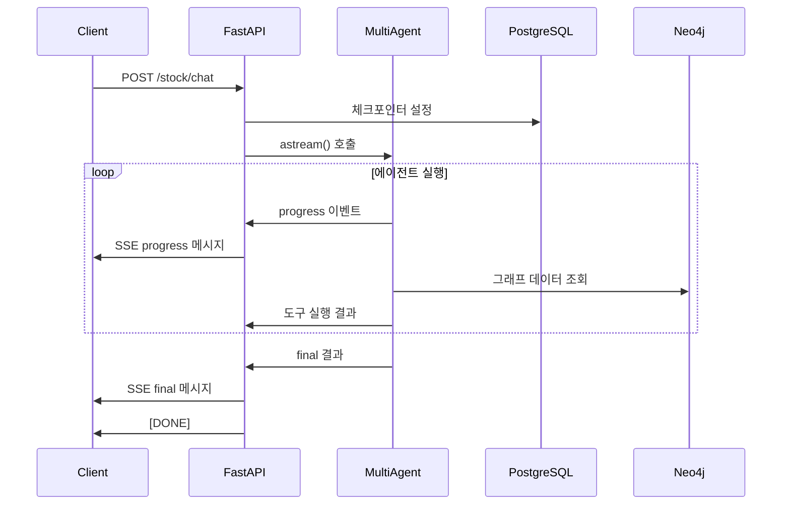

# 📋 Stockelper LLM API 구조 및 통신 방식 분석

## 🏗️ 전체 API 아키텍처

### 1. FastAPI 기반 REST API
- **프레임워크**: FastAPI (비동기 웹 프레임워크)
- **포트**: 21009
- **CORS**: 모든 오리진 허용 (`allow_origins=["*"]`)

### 1-1. 에이전트 초기화(의존성 주입, DI)
- 애플리케이션 기동 시 환경변수 강제 접근을 피하고, 요청 처리 시점에 멀티에이전트를 구성합니다.
- `multi_agent.get_multi_agent(async_database_url)`을 통해 최초 1회 생성/캐시하여 재사용합니다.
- 이때 `ASYNC_DATABASE_URL` 또는 `DATABASE_URL`이 필요하며, 기술/전략 에이전트(DB 접근)에 주입됩니다. (`DATABASE_URL=postgresql://...` 도 자동으로 asyncpg 스킴으로 변환됩니다.)

### 2. 라우터 구조
```
/routers/
├── base.py      # 기본 엔드포인트 (헬스체크, 루트)
├── stock.py     # 주식 분석 메인 API
├── models.py    # Pydantic 데이터 모델
└── __init__.py
```

---

## 🔌 API 엔드포인트 상세

### 📍 Base Router (`/`)
```python
GET /              # 루트 엔드포인트
GET /health        # 헬스체크
```

### 📈 Stock Router (`/stock`)
```python
POST /stock/chat   # 주식 분석 채팅 (메인 API)
```

---

## 💬 메인 API: `/stock/chat` 분석

### 🔄 통신 방식: Server-Sent Events (SSE)
- **프로토콜**: HTTP/1.1 Streaming
- **Content-Type**: `text/event-stream`
- **실시간 스트리밍**: 양방향이 아닌 서버→클라이언트 단방향 스트리밍

### 📨 요청 형식 (`ChatRequest`)
```json
{
  "user_id": 1,                    // 사용자 ID
  "thread_id": "test_thread_id",   // 대화 세션 ID
  "message": "삼성전자 분석해줘",    // 사용자 메시지
  "human_feedback": null           // 사용자 피드백 (트레이딩 승인용)
}
```

### 📤 응답 형식 (SSE Stream)

#### 1. 진행 상황 메시지 (`StreamingStatus`)
```json
{
  "type": "progress",
  "step": "supervisor",           // 현재 실행 중인 에이전트/도구
  "status": "start"              // "start" | "end"
}
```

#### 2. 최종 응답 메시지 (`FinalResponse`)
```json
{
  "type": "final",
  "message": "분석 결과 텍스트...",
  "subgraph": {                   // Neo4j 그래프 데이터
    "nodes": [...],
    "relations": [...]
  },
  "trading_action": {             // 트레이딩 액션 (선택적)
    "order_side": "buy",
    "order_type": "limit",
    "stock_code": "005930",
    "order_price": 100000,
    "order_quantity": 20
  },
  "error": null
}
```

---

## 🔧 핵심 기술 스택

### 1. 비동기 처리
```python
# AsyncConnectionPool로 PostgreSQL 연결 관리
async with AsyncConnectionPool(conninfo=CHECKPOINT_DATABASE_URI) as pool:
    checkpointer = AsyncPostgresSaver(pool)
```

### 2. LangGraph 통합
```python
# 멀티에이전트 시스템과 체크포인터 연결
multi_agent = get_multi_agent(async_db_url)
multi_agent.checkpointer = checkpointer
async for response_type, response in multi_agent.astream(...)
```

### 3. 모니터링 & 추적
```python
# Langfuse를 통한 LLM 호출 추적
"callbacks": [langfuse_handler],
"metadata": {
    "langfuse_session_id": thread_id,
    "langfuse_user_id": user_id,
}
```

---

## 🌊 데이터 플로우



---

## 🎯 특징 및 장점

### ✅ 실시간 스트리밍
- 사용자가 분석 진행 상황을 실시간으로 확인 가능
- 긴 분석 작업도 중간 피드백 제공

### ✅ 상태 관리
- PostgreSQL 체크포인터로 대화 상태 저장
- 세션별 컨텍스트 유지

### ✅ 에러 처리
- 에러 발생 시에도 SSE 형태로 일관된 응답
- 상세한 에러 메시지와 스택 트레이스 제공

### ✅ 운영 안정성 개선 포인트(최근 반영)
- 주문 API에 `hashkey` 필수 헤더 적용 및 헤더 키(appkey/appsecret) 통일
- KIS 토큰 만료 판별 문자열 표준화(“유효하지 않은 token”/“기간이 만료된 token” 모두 처리)
- 외부 I/O 타임아웃 기본 30초 적용(aiohttp ClientTimeout)
- Mongo/DART 클라이언트 지연 초기화로 import 단계 실패 방지
- FDR 데이터에 Change 컬럼이 없을 때 Close 기준 pct_change 생성

### ✅ 확장성
- 비동기 처리로 높은 동시성
- 커넥션 풀링으로 효율적인 DB 연결 관리

### ✅ 모니터링
- Langfuse 통합으로 LLM 호출 추적
- 세션별 사용자 활동 로깅

---

## 📁 파일 구조

### `/routers/base.py`
```python
from fastapi import APIRouter

router = APIRouter(tags=["base"])

@router.get("/")
def read_root():
    """루트 엔드포인트"""
    return {"Hello": "World"}

@router.get("/health")
async def health_check():
    """헬스 체크 엔드포인트"""
    return {"status": "healthy"}
```

### `/routers/models.py`
- **ChatRequest**: 채팅 요청 모델
- **StreamingStatus**: 진행 상황 스트리밍 모델
- **FinalResponse**: 최종 응답 모델

### `/routers/stock.py`
- **generate_sse_response()**: SSE 응답 생성기
- **stock_chat()**: 메인 채팅 엔드포인트
  - 멀티에이전트는 `get_multi_agent(to_async_sqlalchemy_url(os.getenv("ASYNC_DATABASE_URL") or os.getenv("DATABASE_URL")))`로 지연 생성/캐시

---

## 🚀 결론

이 API는 **실시간 AI 주식 분석 서비스**에 최적화된 현대적인 아키텍처를 사용하고 있습니다:

1. **Server-Sent Events**를 통한 실시간 스트리밍
2. **LangGraph 멀티에이전트** 시스템 통합
3. **PostgreSQL 체크포인터**를 통한 상태 관리
4. **Langfuse**를 통한 LLM 호출 모니터링
5. **비동기 처리**를 통한 높은 성능

이러한 설계로 사용자는 복잡한 주식 분석 과정을 실시간으로 추적하며, 안정적이고 확장 가능한 서비스를 제공받을 수 있습니다.
