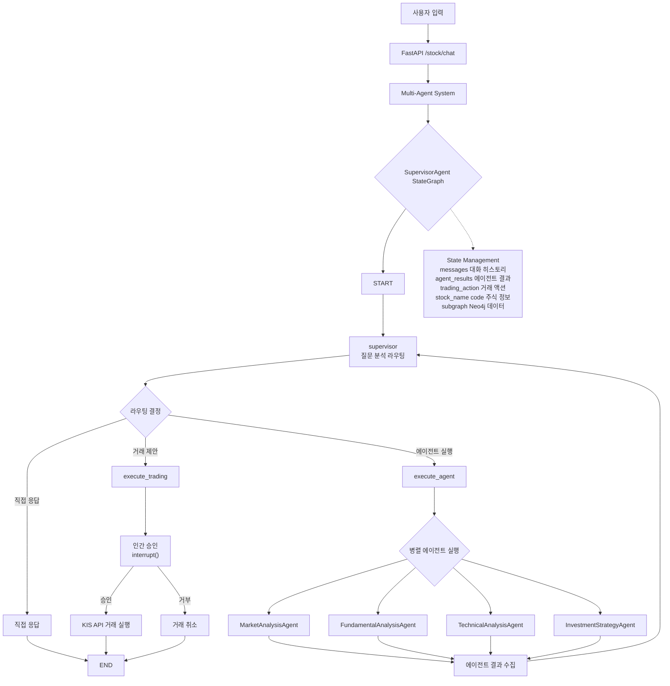
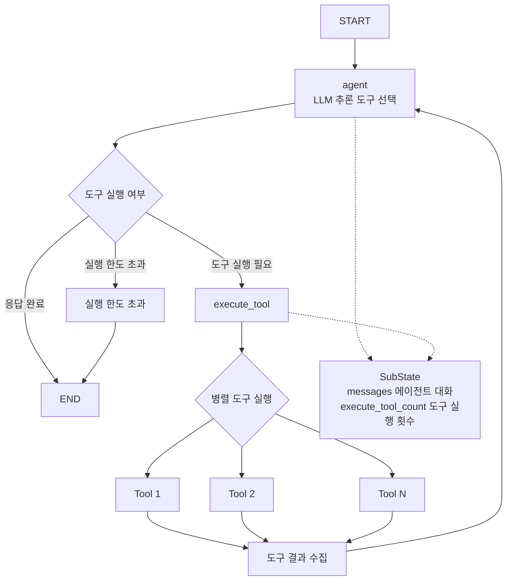
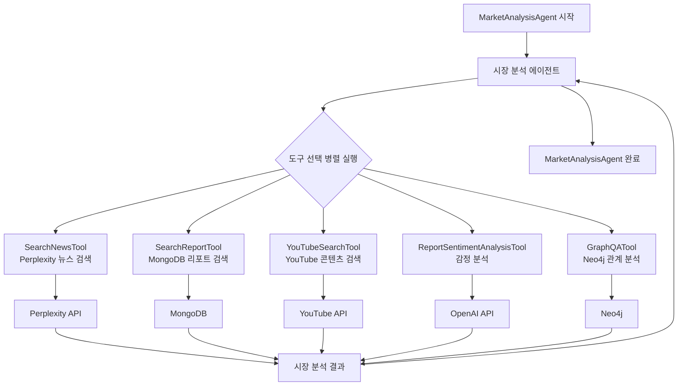
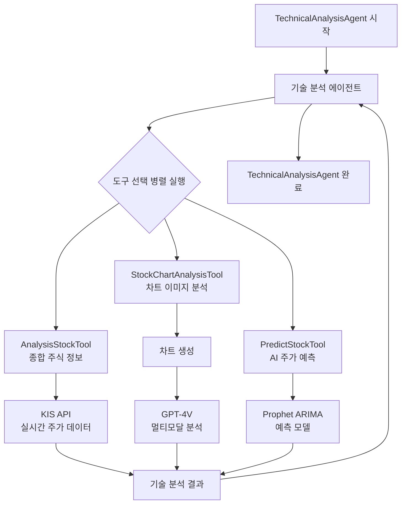
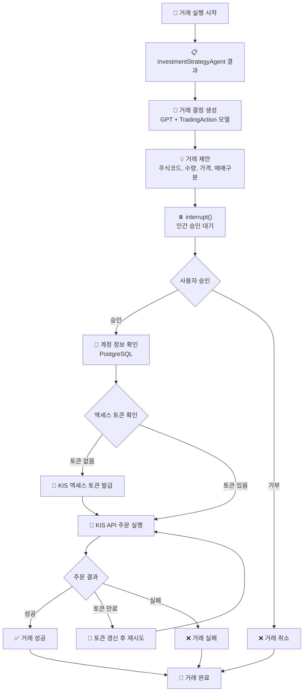
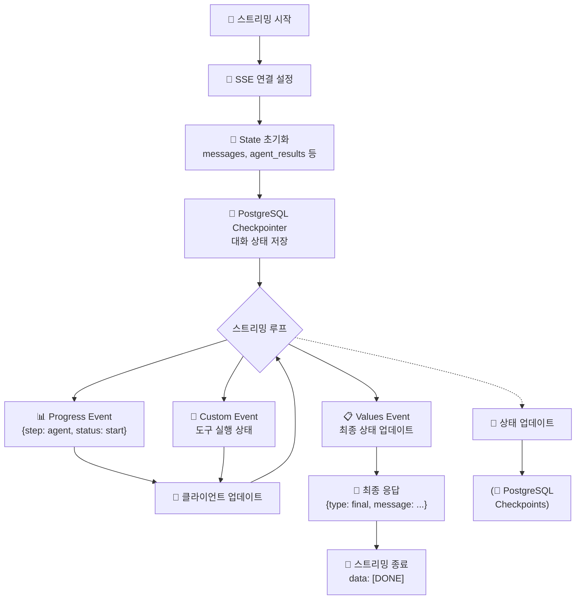
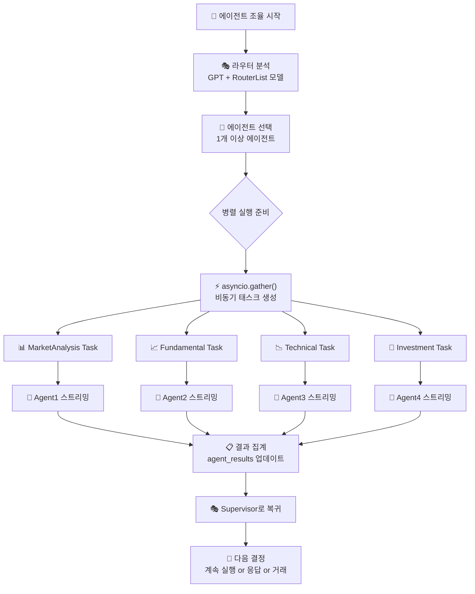

# Stockelper LLM 챗봇 LangGraph 구조도

## 🔄 전체 시스템 LangGraph 구조

## 🤖 BaseAnalysisAgent 공통 구조

## 📊 MarketAnalysisAgent 상세 구조

## 📈 TechnicalAnalysisAgent 상세 구조

## 💰 거래 실행 워크플로우

## 🔄 스트리밍 및 상태 관리

## 🎯 에이전트 조율 및 병렬 처리

---

*이 LangGraph 구조도는 Stockelper LLM 챗봇의 전체 워크플로우와 에이전트 간 상호작용을 시각적으로 표현합니다.*
