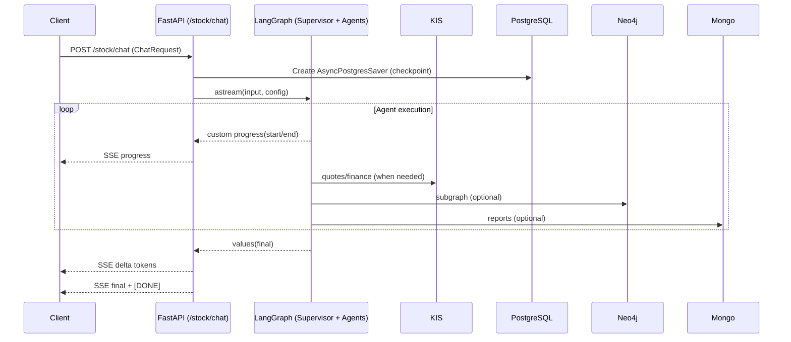

# Stockelper 멀티 에이전트 시스템 상세 문서

본 문서는 `src/multi_agent` 하위 구현을 기준으로, Stockelper의 멀티 에이전트 시스템(에이전트, 도구, 라우팅, 스트리밍, 상태 관리, 외부 연동, 운영 포인트)을 심층적으로 설명합니다.

## 1. 개요와 책임 분리
- 목표: 사용자의 자연어 질의를 기반으로 시장/기술/기초/포트폴리오 분석을 병렬 수행하고, 투자 전략 및 거래 제안을 생성/집행
- 구성 단위
  - SupervisorAgent: 라우팅/조율/거래 단계 orchestration
  - Domain Agents: Market/Fundamental/Technical/Portfolio/Investment Strategy
  - Tools: 각 에이전트에서 호출하는 외부 API 및 계산 도구
  - Checkpointer: LangGraph 상태 저장(PostgreSQL)
  - Streaming: SSE 기반 진행 상황/결과 실시간 전송

디렉터리 개요
- `src/multi_agent/` 루트
  - `__init__.py`: 멀티에이전트 그래프 빌더 `get_multi_agent(async_database_url)` (DI + 캐시)
  - `supervisor_agent/`: 라우팅/조율/거래 수행
  - `*_analysis_agent/`: 각 분석 에이전트와 도구
  - `base/`: 모든 분석 에이전트가 공통으로 사용하는 LangGraph 골격
  - `utils.py`: DB 모델(User), KIS 유틸(토큰, 주문, 해시키), 메시지 머지 로직 등

## 2. 의존성 주입(DI)와 초기화
- `multi_agent.get_multi_agent(async_database_url)`
  - 최초 호출 시 기술/전략 에이전트를 `build_agent(async_database_url)`로 생성
  - 생성된 LangGraph를 캐시에 보관하여 재사용(프로세스 생애 주기 동안 1회 생성)
- 이 방식으로 import 시점 환경변수 강제 접근을 방지하고, 실제 서버 요청 처리 시점에 안전하게 구성
- 서버 라우터(`src/routers/stock.py`)는 요청 시 `get_multi_agent(os.getenv("ASYNC_DATABASE_URL"))`를 호출

## 3. SupervisorAgent: 라우팅/조율/거래
파일: `src/multi_agent/supervisor_agent/agent.py`
- LangGraph State 정의
  - messages, agent_messages, agent_results(최근 10개 유지), execute_agent_count, trading_action
  - stock_name, stock_code, subgraph(Neo4j 결과)
- 그래프 노드
  - `supervisor`: 라우팅 결정 및 거래 여부 판정
  - `execute_agent`: 라우팅된 다수 에이전트를 병렬 실행(astream)하고 결과 집계
  - `execute_trading`: 인간 승인(interrupt) 후 거래 실행(주문)
- 주요 동작
  1) 라우팅: LLM RouterList로 대상 에이전트 목록 생성(필요 시 질의에서 종목명/코드 추출 + Neo4j 서브그래프)
  2) 병렬 실행: 선택된 에이전트를 astream으로 병렬 실행, 각 노드/툴의 진행 상황을 스트리밍(custom 이벤트)
  3) 거래: InvestmentStrategyAgent 결과를 바탕으로 TradingAction 생성 → 사용자 승인 → 주문(place_order)
- 보조 기능
  - 회사명/코드 추출: FinanceDataReader KRX 목록 + difflib 유사도, 1회 캐싱
  - Neo4j 서브그래프: 지정 종목과 경쟁사/섹터 관계를 쿼리

## 4. BaseAnalysisAgent: 공통 LangGraph 골격
파일: `src/multi_agent/base/analysis_agent.py`
- 서브 그래프의 표준 노드
  - `agent`: LLM에 도구를 바인딩하여 호출, 도구 실행 필요 여부를 판단
  - `execute_tool`: 병렬로 도구 호출(asyncio.gather), 결과를 ToolMessage로 반환
- 스트리밍
  - 각 노드/툴 시작/종료 시 `get_stream_writer()`로 custom 이벤트 전송 → SSE의 `type=progress`로 전송됨
- 실행 한도
  - config.configurable.max_execute_tool_count(기본 5)까지만 도구 실행 반복

## 5. 도메인 에이전트와 도구(핵심 모듈)

### 5.1 MarketAnalysisAgent (`src/multi_agent/market_analysis_agent/`)
- Tools
  - `SearchNewsTool`: OpenRouter(Perplexity/sonar)를 통해 뉴스/웹 탐색 요약
  - `SearchReportTool`: MongoDB에서 투자 리포트 문서 조회(지연 초기화)
  - `ReportSentimentAnalysisTool`: OpenAI로 감정 점수/트렌드 분석
  - `YouTubeSearchTool`: YouTube API로 영상 검색 + 자막 요약(최대 1000자)
  - `GraphQATool`: Neo4jGraph + LLM으로 Cypher QA(연결 실패 시 친절한 에러 반환)

### 5.2 FundamentalAnalysisAgent (`src/multi_agent/fundamental_analysis_agent/`)
- Tools
  - `AnalysisFinancialStatementTool`: OpenDartReader로 재무제표 수집 → 핵심 지표 계산
    - OPEN_DART_API_KEY 지연 초기화, 미설정 시 오류 안내

### 5.3 TechnicalAnalysisAgent (`src/multi_agent/technical_analysis_agent/`)
- Tools
  - `AnalysisStockTool`: KIS 현재가 조회 → 주요 지표(PER/PBR/EPS 등) 포함 정보 구성
  - `PredictStockTool`: Prophet + ARIMA 앙상블로 변동률 예측(최근 데이터 기준)
  - `StockChartAnalysisTool`: mojito로 OHLCV 수집 → 기술지표 계산 → 차트 이미지 생성 → LLM Vision 분석
- KIS 토큰 처리: 오류 문구(“유효하지 않은 token”/“기간이 만료된 token”)를 공통 인식, 자동 갱신 후 재시도

### 5.4 PortfolioAnalysisAgent (`src/multi_agent/portfolio_analysis_agent/`)
- Tool: `PortfolioAnalysisTool`
  - KIS 지표 조회(안정성/수익성/기본정보/랭킹)로 종합 점수 산정
  - 모든 외부 호출에 타임아웃(30s) 적용, 토큰 만료 표준 처리

### 5.5 InvestmentStrategyAgent (`src/multi_agent/investment_strategy_agent/`)
- Tools
  - `GetAccountInfoTool`: 사용자 DB(PostgreSQL)에서 KIS 자격을 가져오고, 필요 시 토큰 발급 후 KIS 잔고 조회
  - `InvestmentStrategySearchTool`: OpenRouter로 전략 레퍼런스 탐색
- Supervisor에서 TradingAction 생성 → 사용자 승인 시 주문(place_order)

## 6. 외부 시스템 및 유틸
파일: `src/multi_agent/utils.py`
- DB 모델: `User(Base)` → users(kis_app_key/secret/access_token/account_no)
- KIS 유틸
  - `get_access_token()`: 토큰 발급
  - `check_account_balance()`: 잔고/총 평가금액 조회
  - `get_hashkey()`: 주문 바디로 hashkey 생성
  - `place_order()`: 헤더(appkey/appsecret/authorization/tr_id/custtype/hashkey) 통일, 시장가/지정가 가격 처리, 예외 처리 강화
- 공통 메시지 머지: `custom_add_messages()` → 최신 10개 유지
- 업데이트 가드: `update_user_kis_credentials()`는 사용자 미존재 시 False 반환

## 7. 스트리밍과 체크포인터(서버 연동)
- 서버 라우터: `src/routers/stock.py`
  - PostgreSQL 체크포인터 설정: `AsyncPostgresSaver(AsyncConnectionPool)`
  - LangGraph 실행: `multi_agent.astream(..., stream_mode=["custom","values"])`
    - custom → 진행 상황(progress) 이벤트로 전달
    - values → 최종 값 수신. 서버에서 이를 문자 단위 `type=delta`로 재스트리밍 후 `type=final` 전송
  - SSE 응답 헤더: `text/event-stream; charset=utf-8` + `X-Accel-Buffering: no`

프론트엔드 예시: `src/frontend/streamlit_app3.py`
- `type=progress`: 현재 단계 아이콘 및 상태 표시
- `type=delta`: 토큰(문자) 단위로 누적 렌더링 → 실시간 생성감
- `type=final`: 누적/최종 메시지 표시 + `trading_action` 처리(승인/거부 플로우)

## 8. 라우팅/실행 상세 플로우


## 9. 환경 변수와 설정
- 필수(일부 사용 시)
  - `ASYNC_DATABASE_URL` (에이전트 DI 주입), `CHECKPOINT_DATABASE_URI`
  - `KIS_APP_KEY`, `KIS_APP_SECRET`, `KIS_ACCOUNT_NO`
  - `OPENROUTER_API_KEY`, `OPENAI_API_KEY`, `OPEN_DART_API_KEY`
  - `MONGO_URI`, `NEO4J_URI/USER/PASSWORD`
- DI/지연 초기화
  - 기술/전략 에이전트: DB URL 주입을 강제
  - Mongo/DART: 실제 호출 시점에 키 검증/연결

## 10. 에러 처리와 토큰 표준화
- KIS 토큰 만료 판별을 표준화: 응답 문자열에
  - "유효하지 않은 token" 또는 "기간이 만료된 token" 포함 시 만료로 인식 → 갱신 후 재시도
- aiohttp ClientTimeout(total=30) 기본 적용(대부분 모듈)
- 주문 실패 시 hashkey/헤더/바디 검증 및 예외 메시지 보강

## 11. 성능/운영 포인트
- 에이전트 그래프는 최초 1회 생성 후 캐시 → 오버헤드 축소
- FinanceDataReader KRX 상장 목록은 1회 로드/캐시 → 라우팅시 반복 I/O 제거
- DB 풀/커넥션은 라우터에서 관리(체크포인터) + 에이전트는 주입된 엔진 재사용
- SSE 스트리밍은 UTF-8 charset을 명시해 한글 깨짐 방지

## 12. 확장 가이드
### 12.1 새 에이전트 추가
1) `base/analysis_agent.py`를 상속해 에이전트 구현
2) 필요한 도구(`langchain_core.tools.BaseTool`)를 작성 후 바인딩
3) `<new>_analysis_agent/__init__.py`에 `build_agent(async_database_url)` 작성
4) `multi_agent/__init__.py`의 `get_multi_agent`에서 에이전트 목록에 추가

### 12.2 새 도구 추가(예시)
```python
from langchain_core.tools import BaseTool
from typing import Type
from pydantic import BaseModel, Field

class MyToolInput(BaseModel):
    query: str = Field(...)

class MyTool(BaseTool):
    name = "my_tool"
    description = "설명"
    args_schema: Type[BaseModel] = MyToolInput

    def _run(self, query: str, config, run_manager=None):
        return {"result": "동기 결과"}

    async def _arun(self, query: str, config, run_manager=None):
        return {"result": "비동기 결과"}
```

## 13. 관련 파일 일람
- 그래프/DI: `src/multi_agent/__init__.py`
- 감독자: `src/multi_agent/supervisor_agent/agent.py`, `src/multi_agent/supervisor_agent/prompt.py`
- 공통: `src/multi_agent/base/analysis_agent.py`, `src/multi_agent/utils.py`
- 에이전트/툴: `src/multi_agent/*_analysis_agent/` 디렉터리 참조
- 서버 라우터: `src/routers/stock.py` (체크포인터/스트리밍)
- 프론트: `src/frontend/streamlit_app3.py`

---

본 문서는 코드 변경에 맞춰 유지보수됩니다. 기능 추가/변경 시 본 문서를 업데이트하세요.
